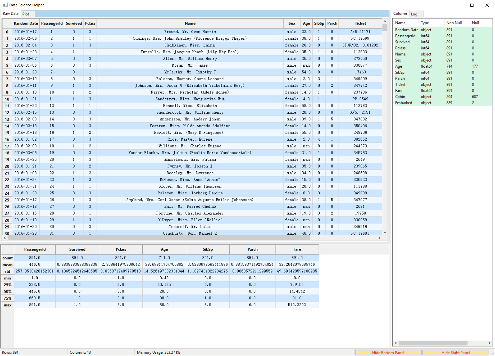
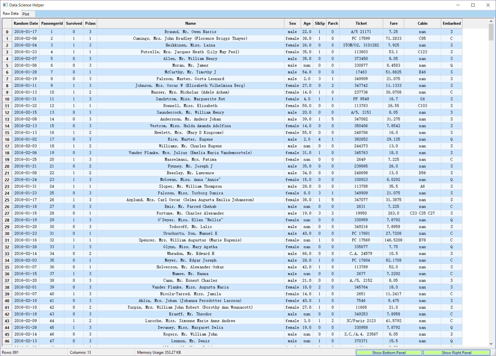
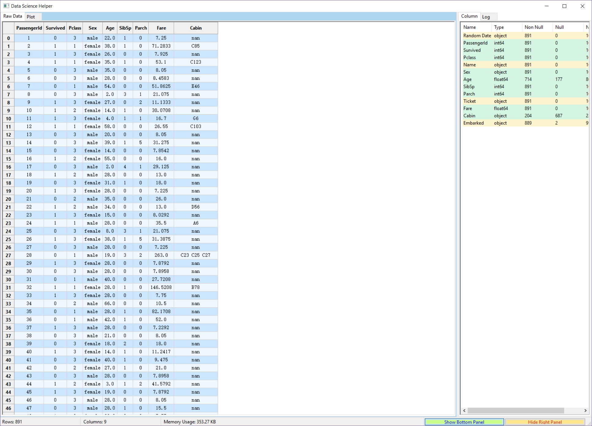
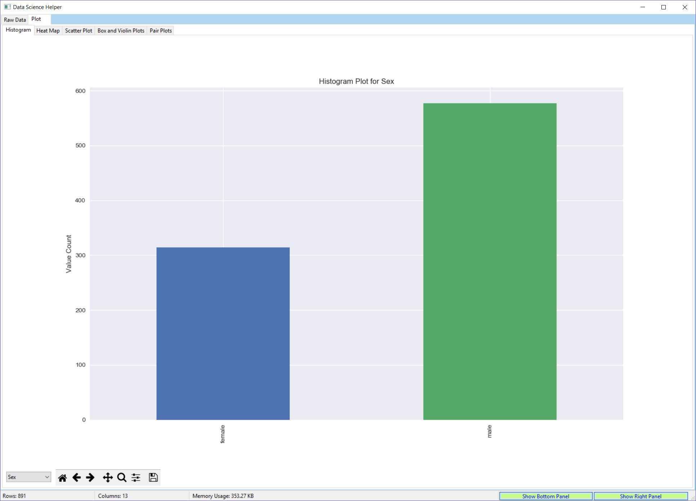
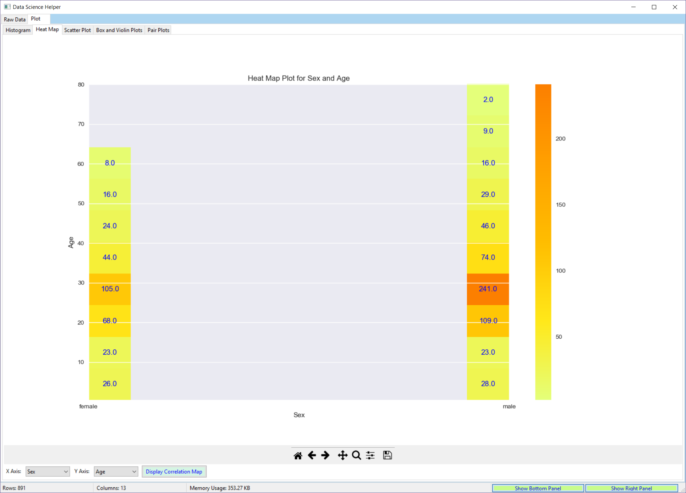
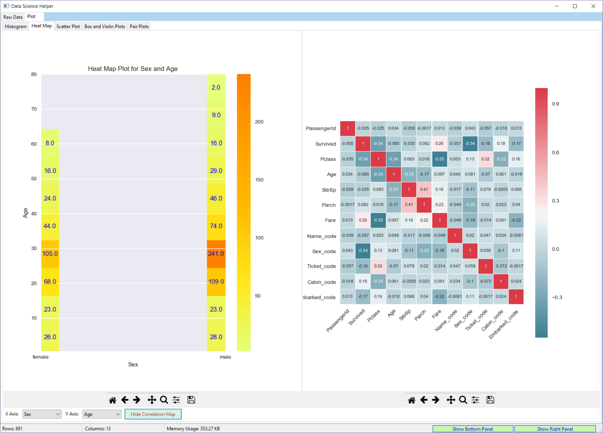
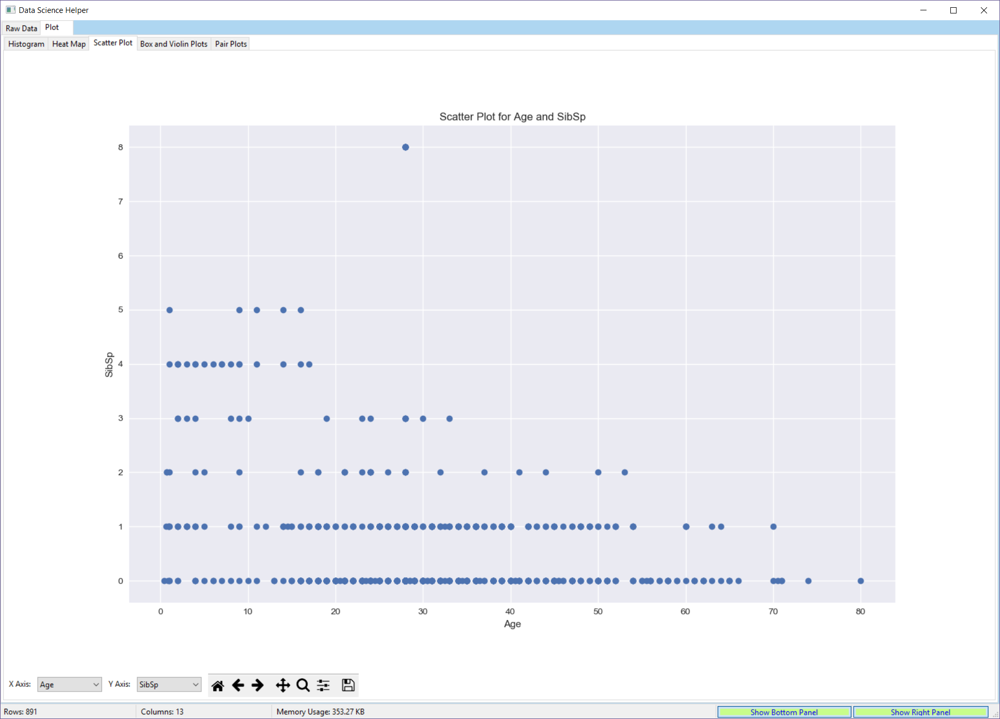
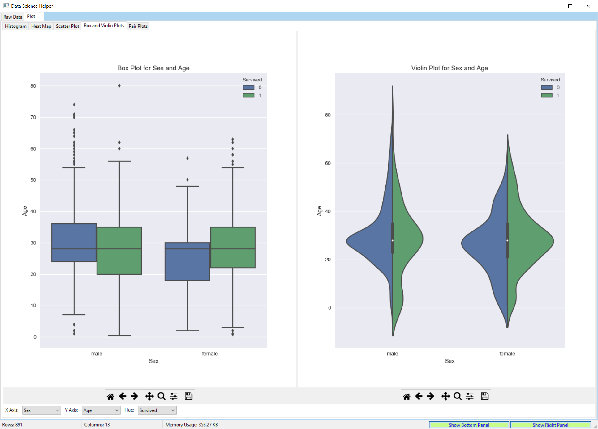
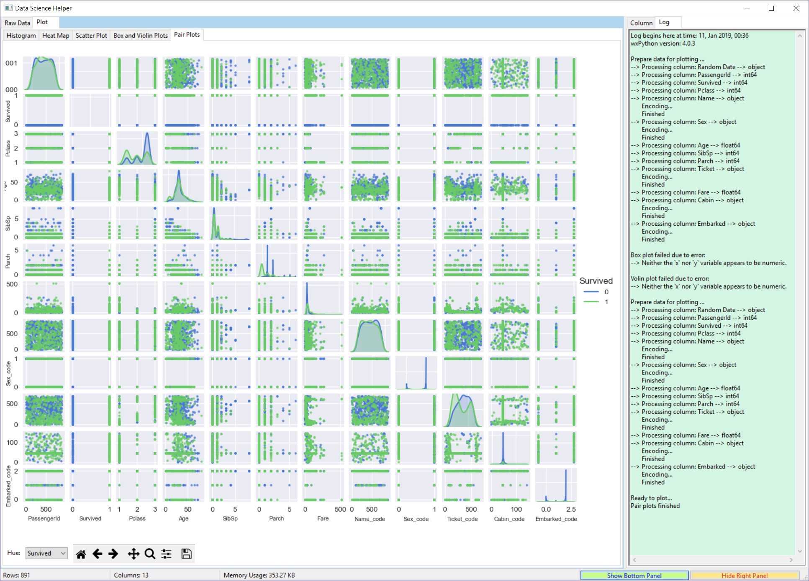

# Data Science Helper

A visualization tool designed to help data scientists better examine their data sets.

## Installation (its on PYPI !!)
```python
pip install dshelper
```

## Usage
```python
import dshelper
dshelper.dshelp(df)
```

## Feature

* [x] Default view with raw data, dataframe info and describe
* [x] Drag on the header to re-arrange columns
* [x] Left click on the right panel to show/hide columns
* [x] Various plots 
* [x] Bottom right buttons to hide panels and focus on data set
* [x] Dockerized with make commands

## Plots

* [x] Histogram
* [x] Heatmap
* [x] Correlation 
* [x] Scatter Plot
* [x] Box Plot
* [x] Violin Plot
* [x] Pair plot

## Demo with Titanic data

The default view, main panel displays the dataset.
The bottom panel displays the statistics of the dataset
The right panel has two tabs, the first one displays the stats for all the columns, the second one displays the system logs.



The bottom and right panels can be hidden by clicking the buttons located on the bottom right of the window. This will allow data scientists to focus on the dataset and plots



You can also drag and drop to re-arrange the column orders, click on the right column tab to hide columns in the main view.



And below are a few plots:








## Dependencies

* wxpython
* matplotlib
* seaborn
* pandas
* numpy
* sciki-tlearn
* scipy
* statsmodels

## How to run locally

* `git clone git@github.com:zmcddn/Data-Science-Helper.git`
* `conda create -n py36 python=3.6` or use virtualenv or pipenv
* `activate py36` (windwos) or `source activate py36` (mac, linux)
* `conda install --yes --file requirements.txt` or `pip install -r requirements.txt`
* In case the `PyPubSub` is not installed with conda, you can do `pip install PyPubSub`
* `cd dshelper`
* `python dshelper.py` (windwos, linux) or `pythonw dshelper.py` (mac)

For help with any dataframe, you can follow the following steps:
* `import dshelper`
* `dshelper.dshelp(df)`


## How to use in Jupyter Notebook

- For running in Jupyter Notebook you need to add `%gui wx` at the top of the file for the GUI to display properly

## Run with docker

* `make build` to build the project
* `make runlinux` to run in Linux
* WIP for mac

## To-do

- next version
    * [ ] Sort by columns
    * [ ] Import file (csv, excl)
    * [ ] Add menu
    * [ ] export file
    * [ ] ability to change cells
    * [ ] standalone version
- next big version
    * [ ] correlation analysis
    * [ ] feature importance
    * [ ] support large file (sampling)
- next next big version 
    * [ ] Support for multiple index
    * [ ] Time series analysis
    * [ ] Optimization

If you like this project, please distribute it and star it for more people to see.
Any suggestions and contributions are very welcomed.

ALL RIGHTS RESERVED
